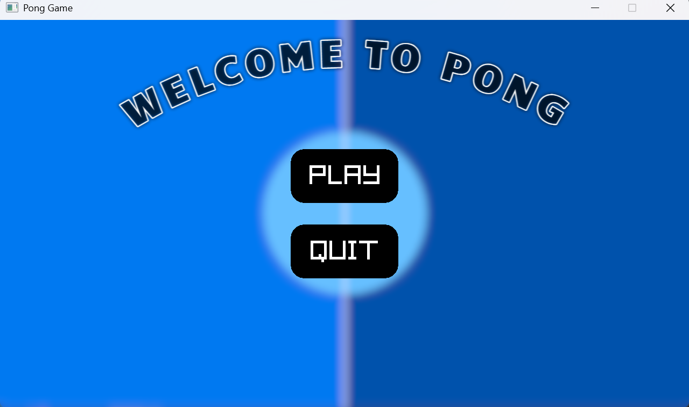
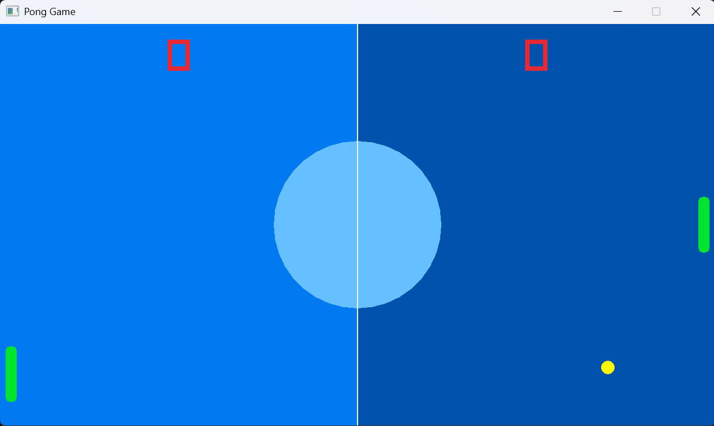
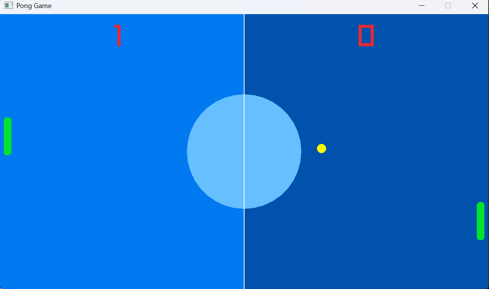
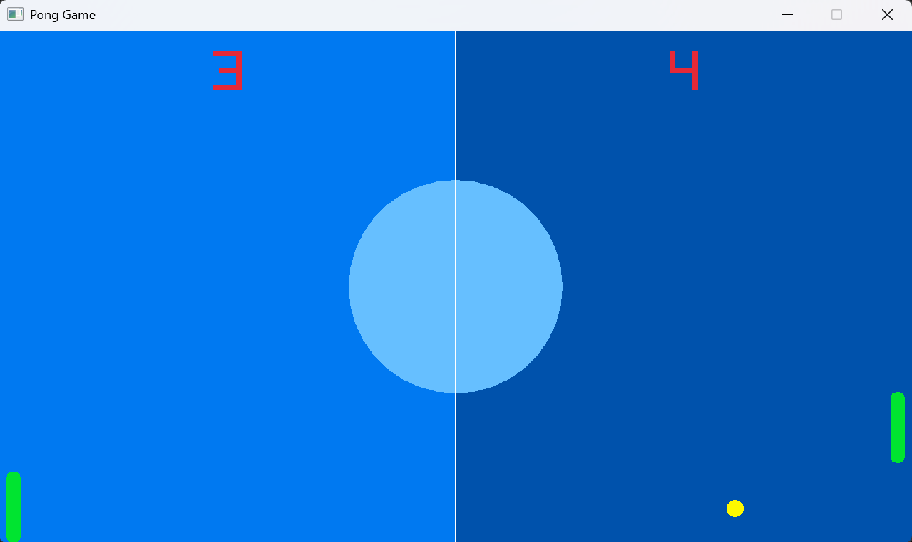

Title & Description : "**Pong Game** - a classic pong game built with Raylib and C++. Play against an AI opponent."

Features:
 1. Player vs AI gameplay.
 2. Main Menu.
 3. Score tracking for both sides.
 4. Collision detection with paddles and walls.
 5. Styled court with center circle and dividing line.
 6. Smooth rounded paddles.

How to Compile and run:
```
g++ Pong_Game.cpp -o pong -lraylib -lm -lpthread
./pong
```

Controls:
| Key | Action |
|-----|--------|
|  W  | Move Paddle up |
|  S  | Move Padddle down |

OOP Design:
1. Abstract Paddle class wiht vitual functions.
2. **player_paddle** subclass-controlled by keyboard.
3. **AI_paddle** subclass-automatically follows the ball.
4. **Ball** class handles movement, collision and scoring.

Built with:
1. C++
2. Raylib
---
**Screenshots**








